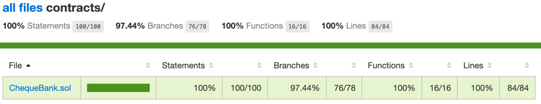

# Week 3 Assignment

## Task 1: Smart Contract Optimization
Gas cost before optimization (unstake after 10 blocks)
```
·---------------------------|----------------------------|-------------|-----------------------------·
|    Solc version: 0.8.9    ·  Optimizer enabled: false  ·  Runs: 200  ·  Block limit: 30000000 gas  │
····························|····························|·············|······························
|  Methods                  ·               17 gwei/gas                ·       1687.91 usd/eth       │
···············|············|··············|·············|·············|···············|··············
|  Contract    ·  Method    ·  Min         ·  Max        ·  Avg        ·  # calls      ·  usd (avg)  │
···············|············|··············|·············|·············|···············|··············
|  FruitStand  ·  stake     ·           -  ·          -  ·     110439  ·            1  ·       3.17  │
···············|············|··············|·············|·············|···············|··············
|  FruitStand  ·  unstake   ·           -  ·          -  ·     170780  ·            1  ·       4.90  │
···············|············|··············|·············|·············|···············|··············
|  MELON       ·  transfer  ·           -  ·          -  ·      52345  ·            1  ·       1.50  │
···············|············|··············|·············|·············|···············|··············
|  WATER       ·  approve   ·           -  ·          -  ·      46846  ·            1  ·       1.34  │
···············|············|··············|·············|·············|···············|··············
|  Deployments              ·                                          ·  % of limit   ·             │
····························|··············|·············|·············|···············|··············
|  FruitStand               ·           -  ·          -  ·     677119  ·        2.3 %  ·      19.43  │
····························|··············|·············|·············|···············|··············
|  MELON                    ·           -  ·          -  ·    1176368  ·        3.9 %  ·      33.76  │
····························|··············|·············|·············|···············|··············
|  WATER                    ·           -  ·          -  ·    1176356  ·        3.9 %  ·      33.75  │
·---------------------------|--------------|-------------|-------------|---------------|-------------·
```

Do the following changes 
- Use immutable to store the contract addresses of Water and Melon .
- Use loop instead of recursive to calculate fibonacci series.
- change fib() to private.
- Pre calculate fibonacci series when deployment.
- Delete unused mapping item after unstake.
- Reduce storage access in unstake().

Gas cost after optimization (unstake after 10 blocks)

```
·---------------------------|----------------------------|-------------|-----------------------------·
|    Solc version: 0.8.9    ·  Optimizer enabled: false  ·  Runs: 200  ·  Block limit: 30000000 gas  │
····························|····························|·············|······························
|  Methods                  ·               10 gwei/gas                ·       1669.55 usd/eth       │
···············|············|··············|·············|·············|···············|··············
|  Contract    ·  Method    ·  Min         ·  Max        ·  Avg        ·  # calls      ·  usd (avg)  │
···············|············|··············|·············|·············|···············|··············
|  FruitStand  ·  stake     ·           -  ·          -  ·     108306  ·            1  ·       1.81  │
···············|············|··············|·············|·············|···············|··············
|  FruitStand  ·  unstake   ·           -  ·          -  ·      54709  ·            1  ·       0.91  │
···············|············|··············|·············|·············|···············|··············
|  MELON       ·  transfer  ·           -  ·          -  ·      52357  ·            1  ·       0.87  │
···············|············|··············|·············|·············|···············|··············
|  WATER       ·  approve   ·           -  ·          -  ·      46846  ·            1  ·       0.78  │
···············|············|··············|·············|·············|···············|··············
|  Deployments              ·                                          ·  % of limit   ·             │
····························|··············|·············|·············|···············|··············
|  FruitStand               ·           -  ·          -  ·    7319445  ·       24.4 %  ·     122.20  │
····························|··············|·············|·············|···············|··············
|  MELON                    ·           -  ·          -  ·    1176368  ·        3.9 %  ·      19.64  │
····························|··············|·············|·············|···············|··············
|  WATER                    ·           -  ·          -  ·    1176356  ·        3.9 %  ·      19.64  │
·---------------------------|--------------|-------------|-------------|---------------|-------------·
```

## Task 2: Smart Contract Development: Ethereum e-Cheque

I finished all the required tasks include the additional tasks. Meet all the requirements with the given interface.

I achieved a high test coverage. Please see the statistic below.  

**Test Coverage**
```
-----------------|----------|----------|----------|----------|----------------|
File             |  % Stmts | % Branch |  % Funcs |  % Lines |Uncovered Lines |
-----------------|----------|----------|----------|----------|----------------|
 contracts/      |      100 |    97.44 |      100 |      100 |                |
  ChequeBank.sol |      100 |    97.44 |      100 |      100 |                |
-----------------|----------|----------|----------|----------|----------------|
All files        |      100 |    97.44 |      100 |      100 |                |
-----------------|----------|----------|----------|----------|----------------|
```
